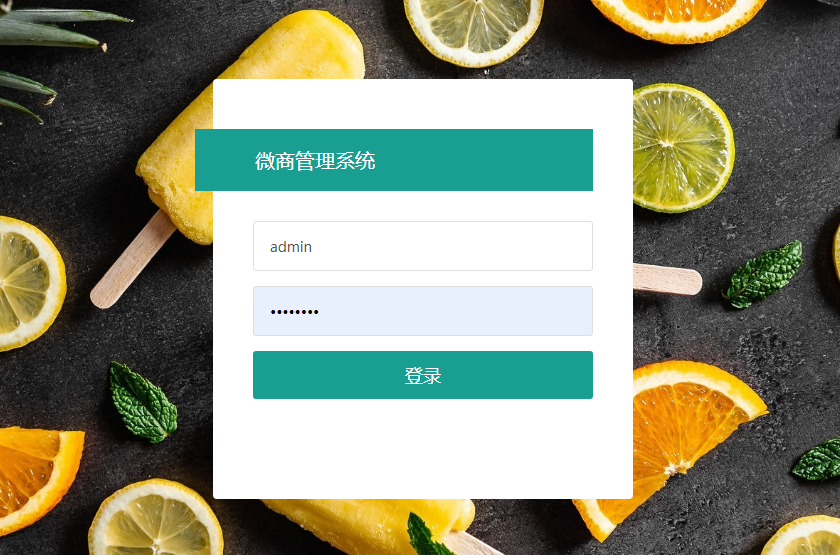
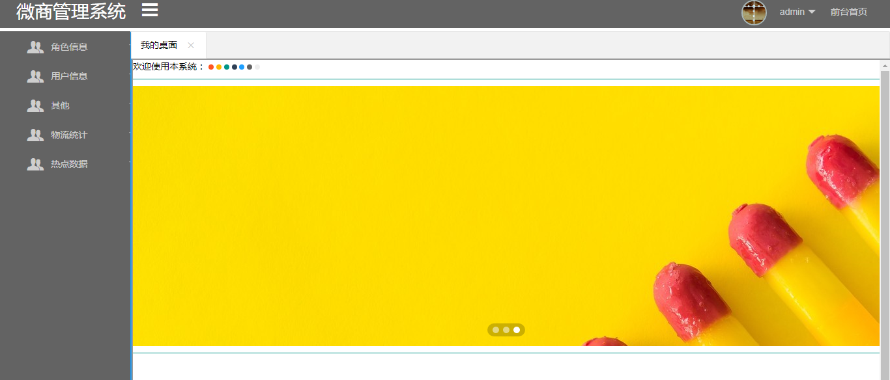
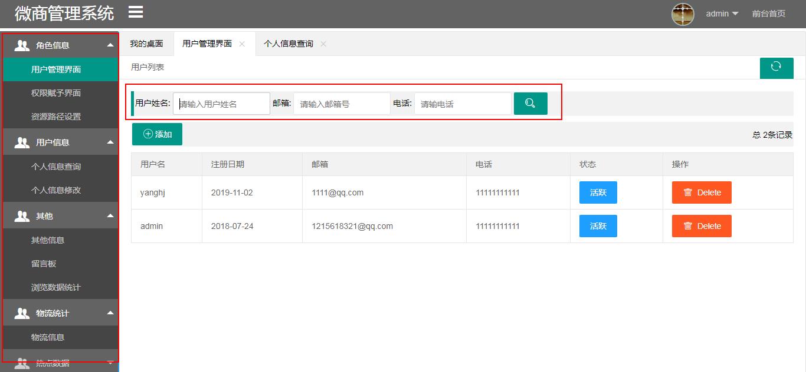
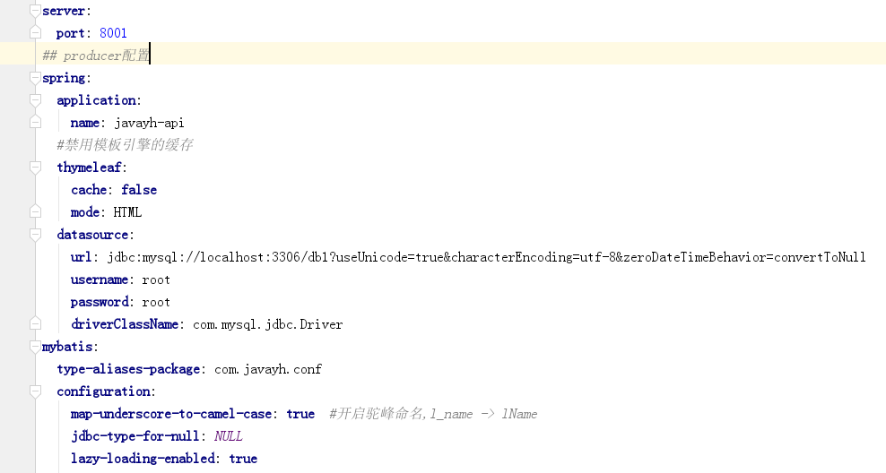
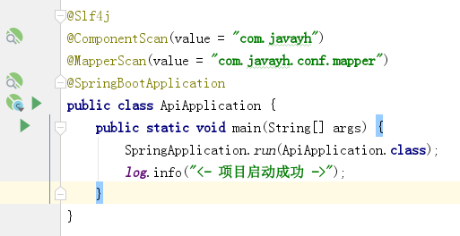

##  Java有货后台管理系统

## 一、简介
> Java有货管理系统采用Springboot作为基础开发框架，使用SpringSecurity作为安装框架，
数据库采用Mysql，实现从登陆到动态菜单的展示！
#### 1.登录页

#### 2.项目初始页

#### 3.动态菜单

## 二、部署流程
#### 1.初始化SQL脚本
> 本项目提供了MySQL初始化脚本（doc/sql.init.sql）
> 修改配置文件本地数据库

#### 2.启动项目- javayh-api

#### 3.访问地址
>localhost:8001

>登录名:admin ,密码:admin123

## 三、在线体验地址
>http://47.105.196.42:8001/index

>登录名:admin ,密码:admin123

## 更多学习资料请看这里
**如遇到问题可以联系小编。微信：372787553，互相学习**

**技术博客：[https://blog.csdn.net/weixin_38937840](https://blog.csdn.net/weixin_38937840)**

**SpringCloud学习代码： [https://github.com/Dylan-haiji/javayh-cloud](https://github.com/Dylan-haiji/javayh-cloud)**

**Redis、Mongo、Rabbitmq、Kafka学习代码： [https://github.com/Dylan-haiji/javayh-middleware](https://github.com/Dylan-haiji/javayh-middleware)**

**AlibabaCloud学习代码：[https://github.com/Dylan-haiji/javayh-cloud-nacos](https://github.com/Dylan-haiji/javayh-cloud-nacos)**
**SpringBoot+SpringSecurity实现自定义登录学习代码：[https://github.com/Dylan-haiji/javayh-distribution](https://github.com/Dylan-haiji/javayh-distribution)**
